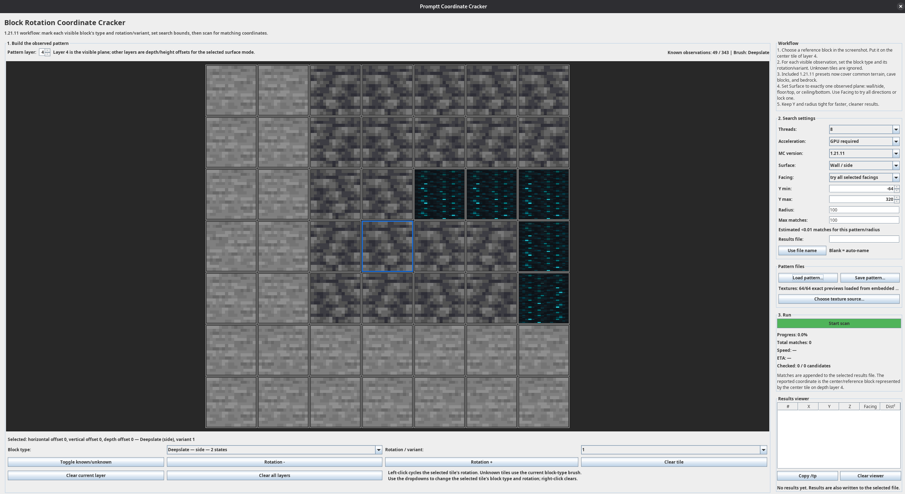

# Promptt Coordinate Cracker

<p align="center">
  
</p>

**Promptt Coordinate Cracker** is a research-oriented Java/Swing application for studying coordinate-derived block-rendering states in Minecraft Java screenshots. It lets a researcher encode visible block rotations, mirrored sides, and model variants in a 7×7×7 local pattern, select search bounds, and scan for world coordinates that are consistent with the observed rendering states.

The project is designed as a reproducible coordinate-fingerprinting lab, not as a general seed cracker or camera-position estimator. It reports candidate block coordinates for the selected reference block under the chosen Minecraft version, surface mode, facing mode, and bounds.

Use this only for screenshots, events, worlds, and servers where coordinate inference is allowed. Dense patterns can reveal location information.

## Research scope

This tool answers one narrow question:

> If the reference block were at coordinate `(x, y, z)`, would Minecraft's deterministic block-model selection render every trusted observation in the same visible state entered in the editor?

A match means the entered observations are consistent with a candidate coordinate. It does not by itself prove screenshot origin, player position, camera orientation, seed, dimension, or server identity. Confidence depends on observation quality, search bounds, and the number of independent matches that remain.

## Highlights

- 7×7×7 pattern editor with block-profile-aware state validation.
- Surface-aware scanning for wall/side, floor/top, and ceiling/bottom observations.
- Origin-outward CPU scanner with a word-level bitmask sieve for compatible patterns.
- Optional persistent OpenCL helper for compatible Minecraft `1.21.11` GPU scans.
- Optional exact SMT bit-vector backend for dense Minecraft `1.21.11` patterns.
- Plain-text `.pattern`-style files that support explicit block profile tokens.
- Self-contained GUI texture previews generated from embedded Java ARGB data; original vanilla PNG assets are not committed.

## Quick start

From a fresh clone with a JDK on `PATH`:

```bash
chmod +x test.sh build.sh
./test.sh
./build.sh
java -jar Promptts_Coordinate_Cracker.jar
```

On Windows, build and run with:

```bat
build.bat
java -jar Promptts_Coordinate_Cracker.jar
```

The current repository does not include a native Windows test runner; `test.sh` can be run from a POSIX shell such as Git Bash or WSL.

If you only downloaded a release jar, run:

```bash
java -jar Promptts_Coordinate_Cracker.jar
```

## Basic workflow

1. Choose a visible reference block in the screenshot.
2. Place that reference block on the center tile of layer 4 in the 7×7×7 editor.
3. For each nearby observation you trust, set the block profile and visible rotation/variant.
4. Leave uncertain or unsupported blocks as unknown.
5. Choose Minecraft version, surface mode, facing mode, Y range, radius, thread count, acceleration mode, and max match limit.
6. Select or auto-generate a results file.
7. Start the scan and review the candidate coordinates in the results table and output file.

For a guided walkthrough, start with [Project walkthrough and methodology](docs/PROJECT_WALKTHROUGH.md), then use [Tutorial and workflow](docs/TUTORIAL.md) for the screenshot-to-scan procedure.

## Documentation

The detailed knowledge base lives in [`/docs`](docs/README.md). The documentation is organized so future Minecraft researchers can start from conceptual material and then move into setup, workflow, file formats, and implementation details.

| Need | Start here |
| --- | --- |
| Understand the whole project, research model, data flow, and limitations | [Project walkthrough and methodology](docs/PROJECT_WALKTHROUGH.md) |
| Install, build, test, and run the application | [Getting started](docs/GETTING_STARTED.md) |
| Learn the screenshot-to-scan workflow | [Tutorial and workflow](docs/TUTORIAL.md) |
| Understand core vocabulary | [Glossary](docs/GLOSSARY.md) |
| Answer common setup and workflow questions | [FAQ](docs/FAQ.md) |
| Understand `.pattern` / text pattern files | [Pattern file format](docs/PATTERN_FILES.md) |
| Pick valid blocks and texture sources | [Block profiles and textures](docs/BLOCK_PROFILES_AND_TEXTURES.md) |
| Configure OpenCL GPU mode | [GPU acceleration](docs/GPU_ACCELERATION.md) |
| Configure the exact SMT solver | [SMT solver backend](docs/SMT_SOLVER_BACKEND.md) |
| Tune runtime flags and guardrails | [Tuning properties](docs/TUNING.md) |
| Understand internals and limitations | [Architecture and detailed design](docs/ARCHITECTURE.md) |
| Review documentation and maintenance standards | [Maintainer review guide](docs/MAINTAINER_REVIEW.md) |
| Verify nothing was removed from the original README split | [Full reference](docs/FULL_REFERENCE.md) |

## Repository layout

```text
src/       Java application source and texture-loading resources
gpu/       Optional OpenCL helper source and build scripts
test/      Dependency-free regression test entry point
docs/      Long-form documentation and maintainer knowledge base
examples/  Example pattern files and screenshots
```

## Build requirements

- JDK with `javac`, `jar`, and `java` on `PATH`.
- `tar` for the POSIX build script.
- Optional: OpenCL runtime and compiler toolchain for GPU helper builds.
- Optional: an SMT solver executable if using the exact bit-vector backend.

## Texture preview note

The default build does not store or package original Minecraft texture PNG files. Instead, the GUI builds vanilla preview images from embedded Java ARGB pixel data generated from the previous vanilla texture bundle. Explicit user-supplied PNG/resource-pack sources are still supported for deliberate overrides. The coordinate predictor does not depend on image files. See [`docs/ASSET_POLICY.md`](docs/ASSET_POLICY.md).

## License

This project is licensed under the GPL-3.0 license. See [`LICENSE`](LICENSE). Minecraft is owned by Mojang/Microsoft.
